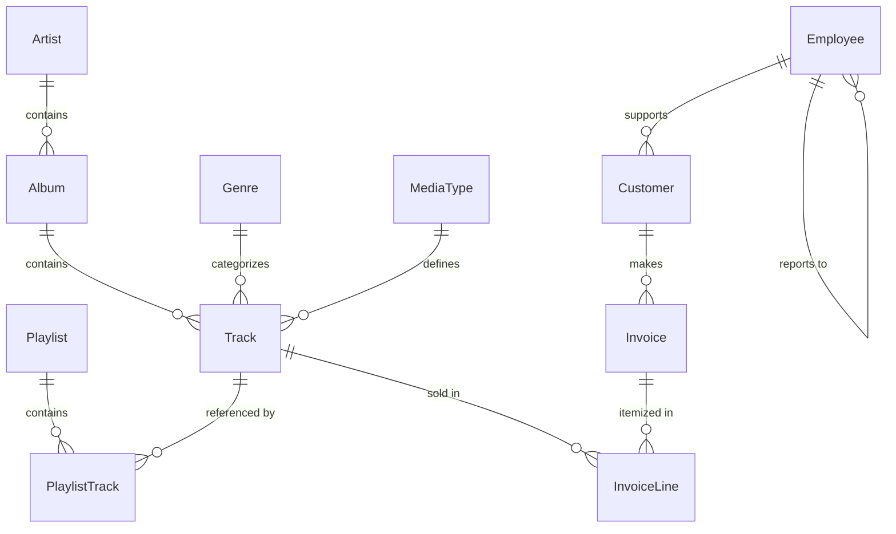

# Chinook SQL Portfolio

A SQL practice project based on the Chinook sample database. 

The goal of this repository is to show how I work with a real relational database using SQL:
- filtering and sorting data
- grouping and aggregating results
- joining multiple tables
- writing subqueries and CTEs
- using window functions for rankings and running totals

## Dataset

This project uses the Chinook database, a sample digital media store. To help visualize the structure, here is the Entity Relationship Diagram (ERD):



## What’s inside

The repository is organized into query sets by topic:

- `01_basic_queries.sql` — SELECT, WHERE, ORDER BY, LIKE  
- `02_aggregations.sql` — COUNT, SUM, AVG, GROUP BY, HAVING  
- `03_joins.sql` — INNER JOIN, LEFT JOIN, multi-table joins  
- `04_subqueries.sql` — scalar, correlated, EXISTS queries  
- `05_window_functions.sql` — RANK, ROW_NUMBER, LAG/LEAD, running totals  
- `06_advanced_analysis.sql` — CTEs, recursive CTEs, KPI-style analysis  

## Why this project

I built this repository to practice SQL in a way that feels closer to real business analysis than isolated toy exercises. Chinook is a good dataset for that because it has customers, orders, products, and sales data all connected through a clean relational model.

## How to run

You only need SQLite. To run any of the query sets, use:

```bash
sqlite3 Chinook_Sqlite.sqlite < queries/01_basic_queries.sql
```

---
*Created as part of a technical portfolio for SQL proficiency.*
