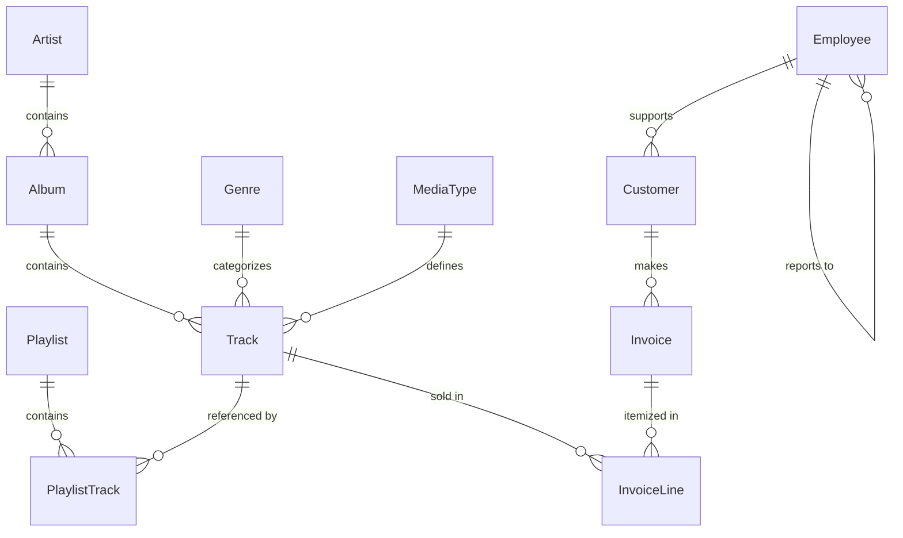

# Chinook Music Store — SQL Portfolio Project

A comprehensive SQL portfolio demonstrating data analysis and business intelligence skills using the **Chinook Database**. This project covers 60 progressively complex SQL queries, ranging from basic data retrieval to advanced analytical techniques using Window Functions and Common Table Expressions (CTEs).

## 📊 Database Overview

The Chinook database represents a digital media store, including tables for artists, albums, tracks, invoices, and customers. It mimics real-world e-commerce data patterns.

### Entity Relationship Diagram (ERD)



## 📂 Project Structure

- `queries/`
  - `01_basic_queries.sql`: Foundational SELECT, WHERE, LIKE, ORDER BY.
  - `02_aggregations.sql`: GROUP BY, HAVING, and aggregate functions (SUM, AVG, COUNT).
  - `03_joins.sql`: Inner, Left, and Self-joins across multiple tables.
  - `04_subqueries.sql`: Scalar, Correlated, and EXISTS subqueries.
  - `05_window_functions.sql`: RANK, ROW_NUMBER, LAG/LEAD, and running totals.
  - `06_advanced_analysis.sql`: CTEs, Recursive CTEs, Market Basket Analysis, and business KPIs.
- `schema.sql`: Annotated database schema and documentation.
- `Chinook_Sqlite.sqlite`: The SQLite database file used for all queries.

## 🚀 Skills Demonstrated

- **Data Retrieval**: Efficiently querying large datasets with filters and sorting.
- **Aggregations**: Summarizing data to extract business insights (e.g., total revenue, average order value).
- **Relational Logic**: Connecting disparate data points via complex JOIN structures.
- **Window Functions**: Performing sophisticated calculations across sets of rows (rankings, running totals).
- **Business Intelligence**: Using CTEs and CASE statements for customer segmentation, cohort analysis, and trend reporting.
- **Schema Design & Documentation**: Deep understanding of relational database constraints and documentation.

## 🛠️ How to Run

Requirements: `sqlite3`

1. Clone this repository.
2. Run any query file using the SQLite CLI:
   ```bash
   sqlite3 Chinook_Sqlite.sqlite < queries/01_basic_queries.sql
   ```
3. To explore the schema:
   ```bash
   sqlite3 Chinook_Sqlite.sqlite ".schema"
   ```

---
*Created as part of a technical portfolio for SQL proficiency.*
